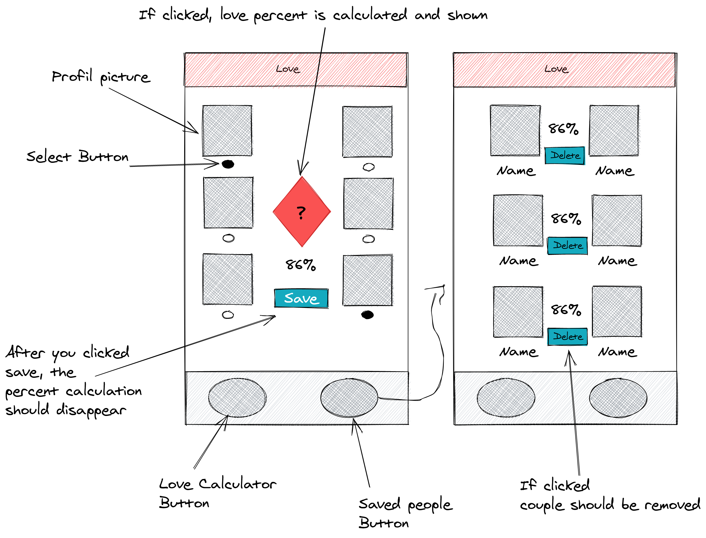

# API repo for the amor exercise

You are amor, the greek good of love. You handle all of the love on earth.
Because you want to compete with all of the other love internet platforms on earth you started to begin to digitalize your workflow.

Your little love-minions created an api where you get 40 random people back to you. Now you have to build an app where you can select two people and your secret algorithm calculates the "love potential" of these two individuals.

Your secret algorithm is:

```
Every person has a list of interests. If the lists, compare to each other, have a high score, these persons are meant for each other.

E.g.:
person #1 list: [true, true, false, true, false, false]
person #2 list: [true, false, true, false, false, false]

Everytime somethings matches, like true === true or false === false your algorithm gives the couple an 1 for every index

If something true === false your algorithm gives the couple a 0

The result for the above two lists would be: [ 1, 0, 0, 0, 1, 1] and the love potential would be: 50 %.
The formular would be: 100 / amountOfListEntrys * amountOfOnes
Everything above 66% is considerable good (Chances are high, people fall in love)
50% is fifty-fifty
Everything under 35% would not fall in love.

```

## Task

Create an App which shows on the right side 20 people and on the left side 20 people. You can select only one person per side. After you selected a person on the right side and one on the left side you can hit the `Calculate love potential` button and your app should output the calculation. If the percent over 66% you should save these to people in localStorage so that your love-minions can visit the `saved people` site in your app to get the job done and let these people fall in love with each other.

## Design Orientation


